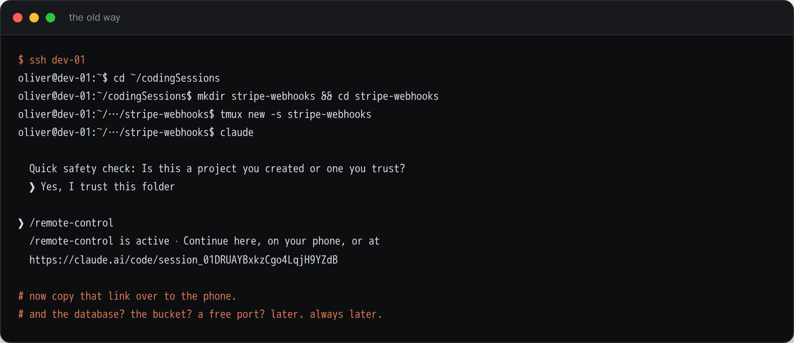
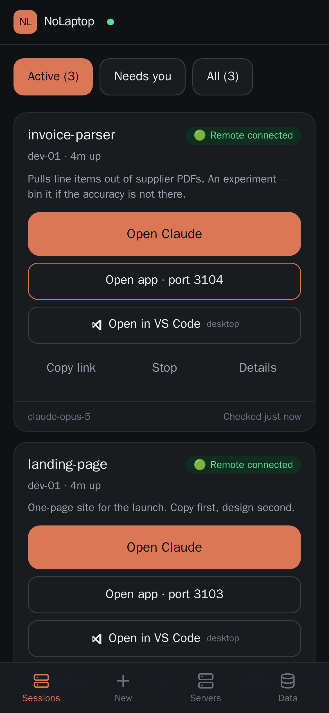
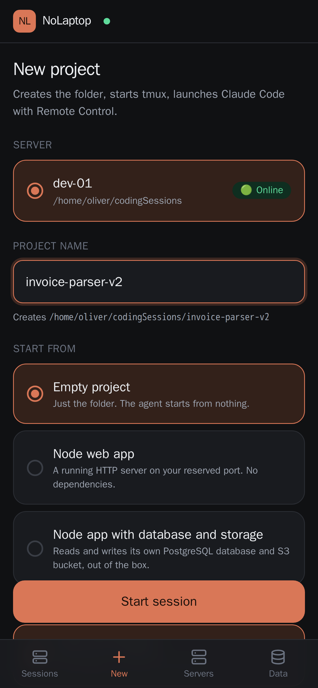
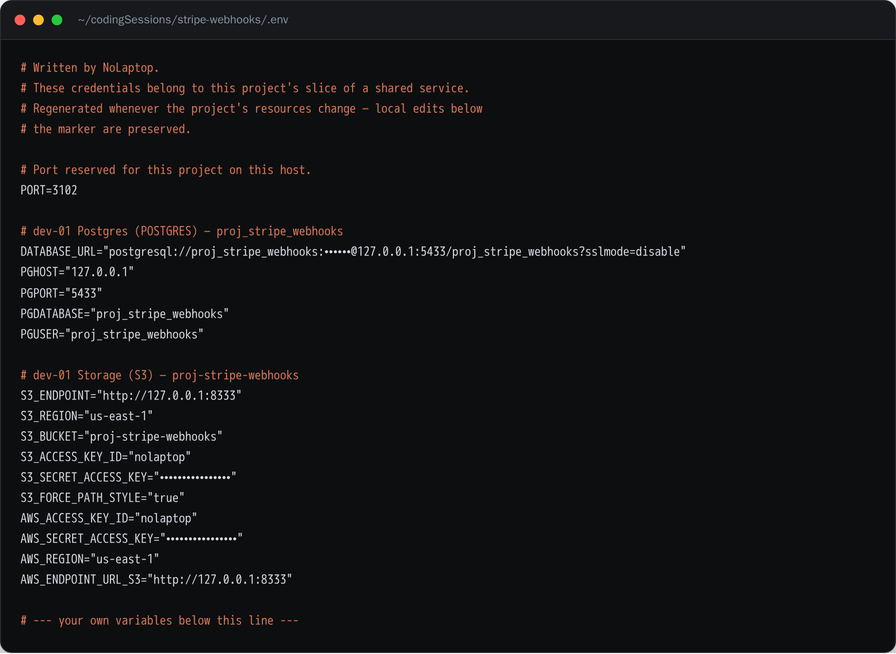
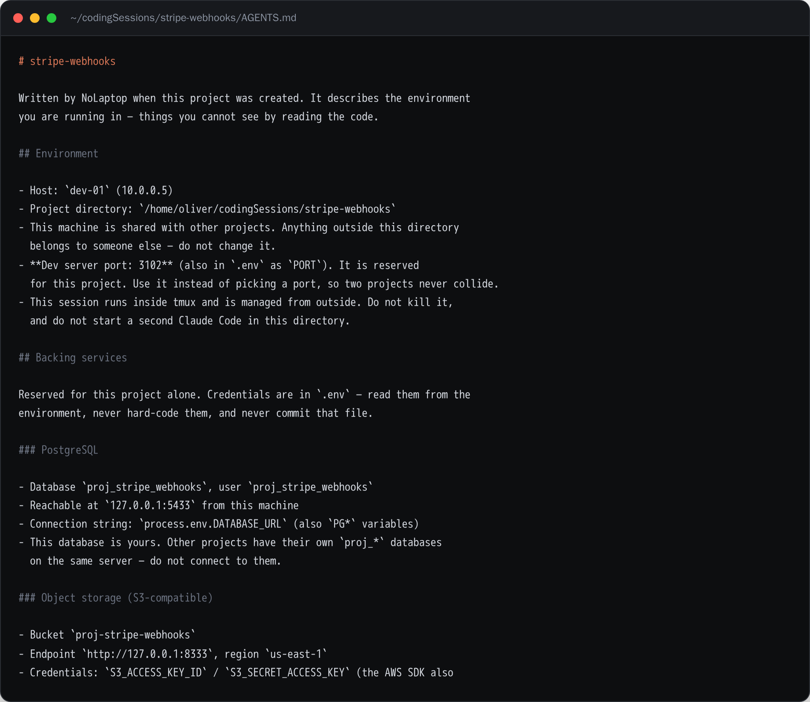
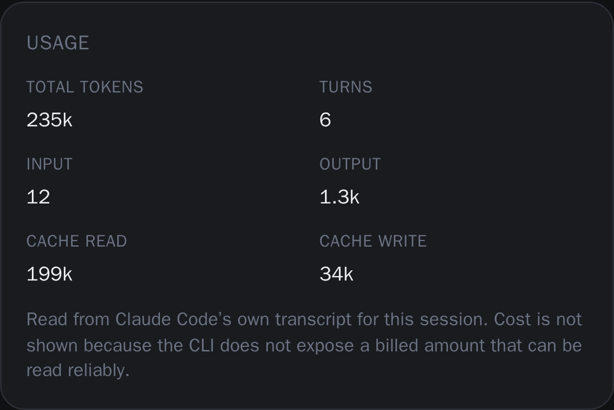
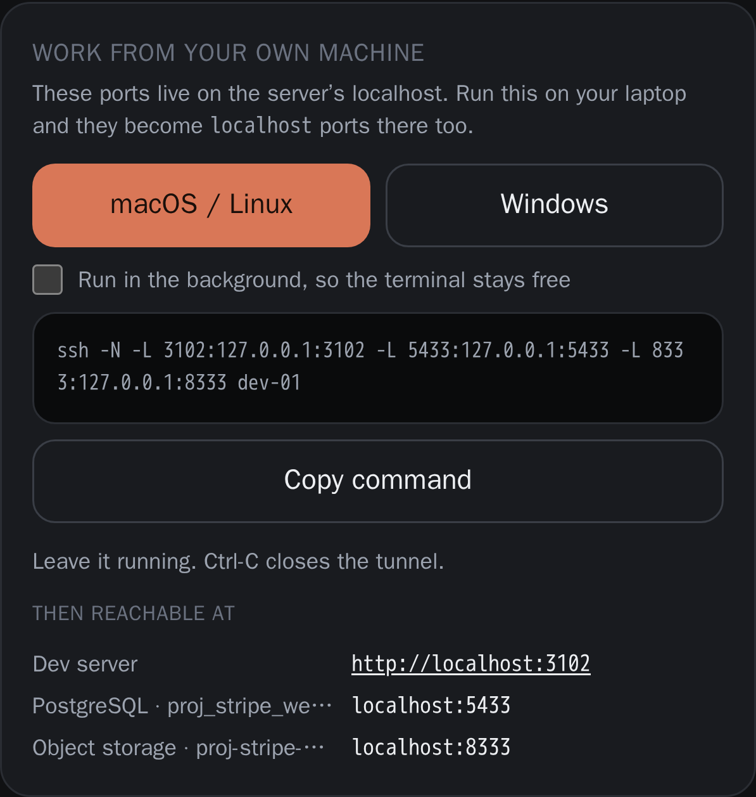
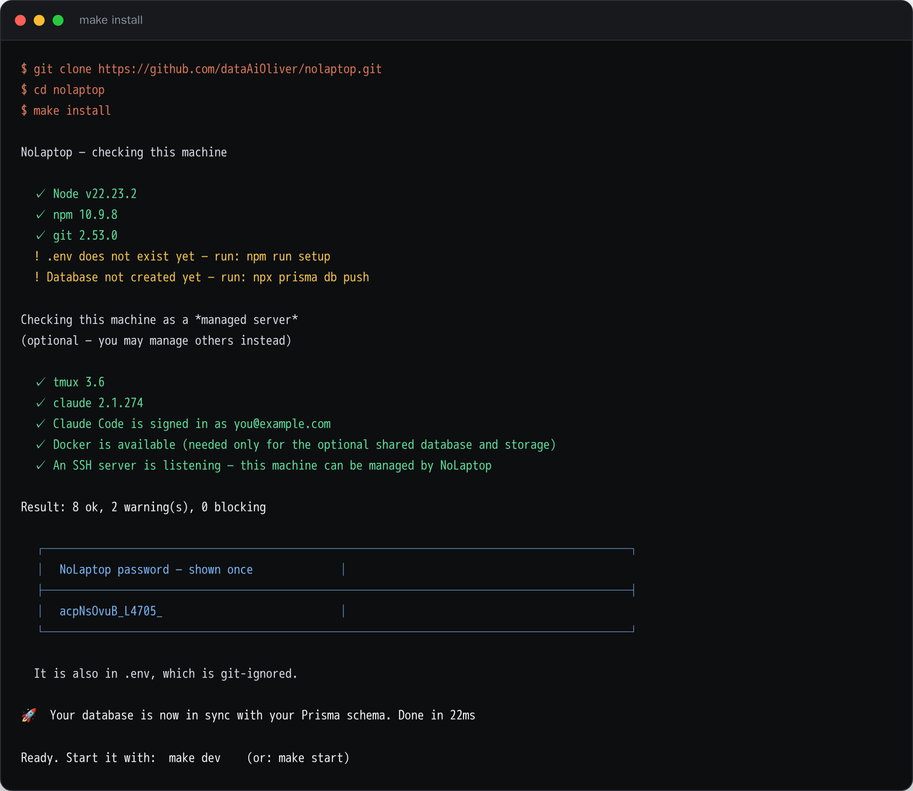
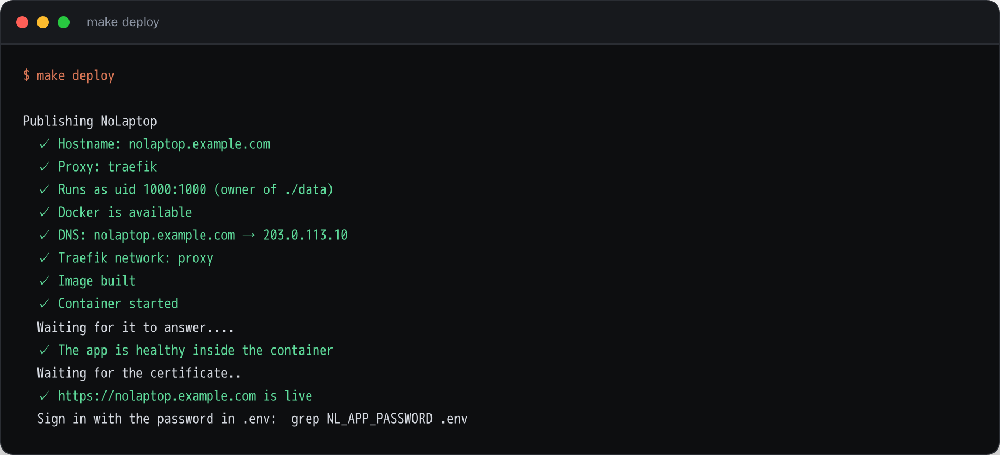
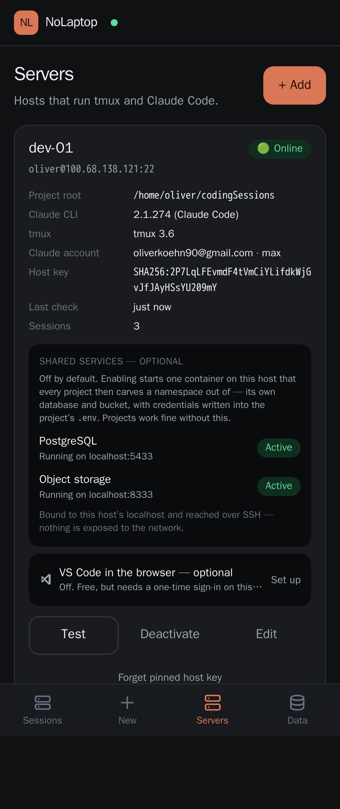

# I got too lazy to open my laptop, so I built a button

*Starting a coding agent on a remote server used to take eight steps. Now it takes
three taps on a phone — and the project already has a database, a bucket and a free
port when the agent wakes up.*

---

I run most of my coding agents on remote servers rather than my laptop. Better
hardware, always on, and the thing keeps working when I close the lid.

The problem was never the running. It was the starting.

Every time I had an idea — on the sofa, on a train, in a queue — the idea had to wait
until I was back at a desk. Because starting it looked like this:



Eight steps, and at the end I still had to get that link onto my phone. And notice what
is *not* in there: no database, no object storage, no reserved port. Those came later.
They always came later, usually at the exact moment they became annoying.

So I built a button.

---

## Three taps



That is the whole product. A list of what is running, what each one is doing, and one
large button per project that opens it in Claude.

Making a new one is a name and a tap:



Pick a server. Type a name. Optionally tick a starter template and the backing
services. Tap **Start session**.

About forty seconds later the project is there, the agent is running, and a starter app
is already serving on a port that belongs to that project alone.

---

## What actually happens when you tap that button

This is the part I care about more than the dashboard, because it is the part that
stops me re-explaining my own setup to an agent every single time.

On the server, NoLaptop:

1. creates the project directory inside a root you configured — and nowhere else;
2. reserves a free port for it, checked against what is actually listening on the host;
3. creates a **PostgreSQL database of its own**, with its own owning role and a
   generated password;
4. creates an **S3 bucket of its own**;
5. writes both, plus the port, into the project's `.env`;
6. writes an `AGENTS.md` describing all of it;
7. drops in a starter template and starts it;
8. launches Claude Code with Remote Control on, in a tmux session that survives
   everything.

Here is the `.env` it wrote for a real project of mine:



And the instructions file next to it:



That last file is the one that changed how this feels to use. The agent opens the
folder already knowing which database is its own, which bucket is its own, which port
it may bind, and — importantly — that the machine is shared and everything outside its
directory belongs to somebody else.

I did not have to type any of that. I have typed it a hundred times before.

### `AGENTS.md`, not `CLAUDE.md`

A small thing worth knowing, because I got it wrong first. Claude Code reads
`AGENTS.md` natively — and so do Codex, Cursor and the Gemini CLI. But if a project
contains **both** files, Claude Code uses `CLAUDE.md` and ignores `AGENTS.md`
completely.

So one file covers every agent, the other covers one, and having both is a quiet way to
lose the context you carefully wrote. NoLaptop writes exactly one and warns if the other
shows up.

---

## The bit I underestimated: knowing what is actually true

A dashboard you check from a phone is only worth having if you can trust it. "The
database says this session is running" is worthless — the session might have died
twenty minutes ago.

Claude Code turns out to keep a lot of machine-readable state, which makes this much
less hacky than I expected:

| Question | Where the answer really is |
| --- | --- |
| Which agent processes are running? | `claude agents --json` |
| Is Remote Control on, and what is its link? | `~/.claude/sessions/<pid>.json` → `bridgeSessionId` |
| Is this host signed in? | `claude auth status --json` |
| Token usage | Claude Code's own transcript, `.jsonl` |

That last column matters. A session with no `bridgeSessionId` genuinely has no Remote
Control — that is a fact, not a guess from scraped terminal output. The terminal only
gets read when the structured sources say something is off, and then only to work out
*which* dialog is blocking.

Anything that cannot be determined reliably is shown as **Not available**. Cost is one
of those: the CLI exposes no billed amount I can read honestly, so no number is
invented.



---

## When something needs you

Agents get stuck. They want a sign-in, or a one-off confirmation, or the Remote Control
bridge drops. From a phone, the worst possible answer is a dashboard that just stops
updating.

So the states are explicit, and each one comes with the single action that resolves it:
a dropped bridge offers **Reconnect** (which keeps the conversation), a stopped session
offers **Resume**, a sign-in offers the sign-in link.

I learned this the sharp way. A perfectly healthy session kept reporting "Approval
required", and it took me a while to see why: Claude's status bar permanently reads
`bypass permissions on`, and my matcher was looking for the word "permission" near
"remote control". Every healthy session tripped it. That kind of false alarm is worse
than no status at all — you stop believing the dashboard, and then it is just a slower
way to run `ssh`.

---

## Then you sit down at a laptop

Everything NoLaptop starts binds to the server's localhost. The database, the object
store, the dev server. That is the right default — a database with a generated password
on an open port is how these stories usually end — but it means you cannot simply type
the server's address into a browser.

So each project hands you the exact command:



It collects the project's dev port, anything you saved on it, and its own database and
bucket, so a local `psql` or S3 client reaches them too. There is a Windows variant next
to it. Windows 10 and 11 ship the `ssh` client, so it is the same command.

---

## Setting it up

You need a Linux host with `tmux`, the `claude` CLI signed in, and SSH key access. That
is it.



`make check` changes nothing — it just tells you what is missing. `make install`
generates the two secrets, creates the database and prints the password once.

NoLaptop **refuses to start without a password**. It holds SSH keys for every server you
add; an open instance of that is a remote shell for whoever finds the port. That is not
a setting.

Putting it on a hostname with TLS is one command, and it checks the things that actually
go wrong before it tries:



It works with an existing Traefik, or brings its own Caddy, or stays on localhost.

---

## The optional part: shared services

Off by default, on the server's card:



Enabling starts one PostgreSQL and one SeaweedFS container on that host, bound to its
localhost and reached through the SSH connection NoLaptop already has. Nothing is
published to the network. Every project then gets its own database and its own bucket
out of that one instance.

I picked **SeaweedFS over MinIO**, which surprised me too. MinIO closed anonymous pulls
of `minio/minio` — a default that fails on a fresh host is not a default — and moved its
community edition behind AGPL. SeaweedFS is Apache-2.0 and speaks the S3 verbs this
needs. For a tool whose whole point is that you own the machine, the object store should
be one you get to keep.

---

## What it is not

It does not replace Claude Code, or wrap it, or proxy it. Claude runs on your server
exactly as it would if you had typed the command yourself; NoLaptop just types it, keeps
an eye on it, and gets out of the way.

It does not handle your Anthropic credentials. Sign-in happens through the official
flow; the app shows you the link.

It does not do anything destructive on its own. Removing a project leaves the folder,
the conversation, the database and the bucket exactly where they are. Dropping data
takes an explicit request and two confirmations.

And there is no "run arbitrary command" API. Two files hold the complete set of
operations that can reach a server, every interpolated value is quoted, and project
paths are derived on the server rather than accepted from a browser. If that sounds
paranoid: the thing is holding SSH keys to every machine you add.

---

## Most of the bugs only showed up when I ran it

I want to be honest about this, because it is the most useful thing I can pass on.

Almost everything that was wrong looked right in the code:

- The Docker image skipped a native module's build step, so every database call failed
  the moment you were authenticated.
- The container ran as a user that could not write the mounted data directory, so SQLite
  opened read-only and every status update vanished **silently**. The dashboard simply
  froze in the past.
- Signing in is a client-side navigation, so the component that loads data never
  re-ran — the dashboard sat on its skeletons forever. Every test I had written
  navigated with a full page load afterwards, which hid it perfectly.
- Two projects launched in the same second both got the same port, because the
  allocator read the free list before either had written. A unique index fixed it; a
  code review would not have.

None of those were found by reading. All of them were found by tearing the whole thing
down and building it back up from an empty machine.

---

## Try it

It is MIT-licensed and on GitHub:

**https://github.com/dataAiOliver/nolaptop**

```bash
git clone https://github.com/dataAiOliver/nolaptop.git
cd nolaptop
make check      # tells you what is missing, changes nothing
make install
make dev
```

There is a `make demo` that creates two example projects on a server and tells you
exactly what it did — one plain, one wired to its own database and bucket — and a
`make demo-clean` that removes them again.

I built this because I wanted it. If it is useful to you, take it. If you want to
change something, the Claude-specific parts sit behind a single adapter file, so
another agent — Codex, the Gemini CLI — is a sibling of that file rather than a
rewrite.

Issues and pull requests are welcome. So is a note saying it did or did not work for
you: **data.ai.oliver@gmail.com**.

Now, if you will excuse me, I have a questionable side project to start. I am on a bus.
